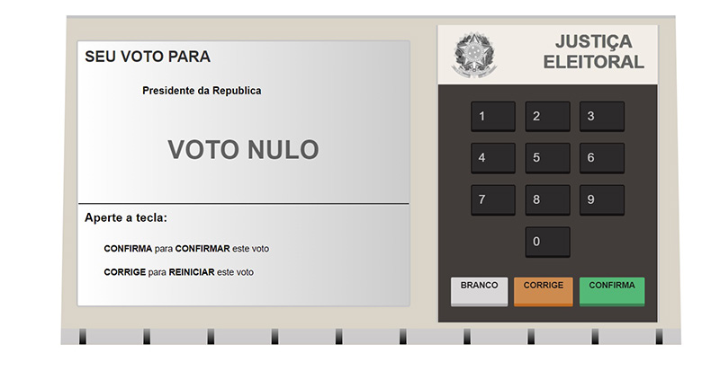
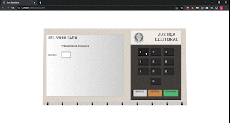

# Urna Eletrônica 🤖

Urna eletrônica criada a fim de estudos, mais precisamente efeitos no DOM com javascript.
 
Foi bem divertida toda a criação dela, desde o layout com css até as funcionalidades com Javascript.
  
Sinto que poderia ter economizado nas linhas de códigos usando **Classes** do JS para os candidatos, mas acabei não fazendo isso (ainda).
 
Também foi muito bom para por em prática a separação do Script por módulos, desse jeito não fica tão poluido.

O que foi usado: 
* **HTML5**
* **CSS3**
* **Javascript**

Ela ainda não está 100% completa, no momento só tem 3 candidados:
 
 

* Ciro 12
* Lula 13
* Bolsonaro 17
* Opção de votar NULO

Pretendo colocar todos os outros futuramente quando sair a lista oficial de candidatos e seus respectivos números.

Ela ainda não está **RESPONSIVA**, então para visualização 100% precisa ser em um browser de um desktop.
 
Porém, eu planejo deixar ela 100% responsiva.
 
Você pode visualizar ela completa e testar pelo link:
https://joeljsilva.github.io/urna-eletronica-js/